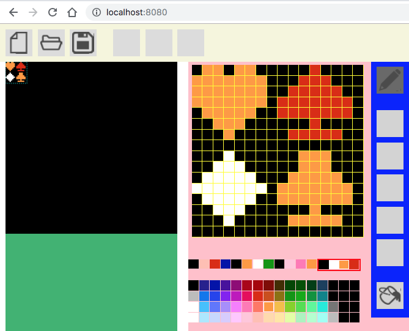
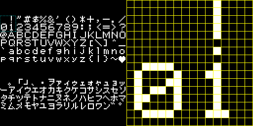

# chrEditor
[][release]
[][license]

[release]: https://github.com/landm2000/chrEditor/releases  
[license]: https://raw.githubusercontent.com/landm2000/chrEditor/master/LICENSE

Sprite Editor of NES(Nintendo Entertainment System) at Web

## Description

 This is Sprite Editor (Graphic Editor) for Game console of Nintendo Entertainment System
at Web System. I'm writing this source code by JavaScript (using React,Bootstrap,
and so on...).

## Demo

## VS. 

: Graphic Editor for NES, SNES, PCE, GB/C, etc...(Windows)

## Requirement

## Install

    $ git clone https://github.com/landm2000/chrEditor [Enter]
    $ cd chrEditor [Enter]
    $ npm install [Enter]

## Usage

    1. Start the App on your PC.
      $ npm start [Enter]
    2. Access from the Web browser(Chrome or firefox).
      http://localhost:8080/

## Contribution

1. ~~I need a free font (Make an 8-bit font, please).~~ 
1. I need a free character (Make an 8-bit free character like Mario, please).

## Licence

[][license]

[license]: https://raw.githubusercontent.com/landm2000/chrEditor/master/LICENSE

## Author

